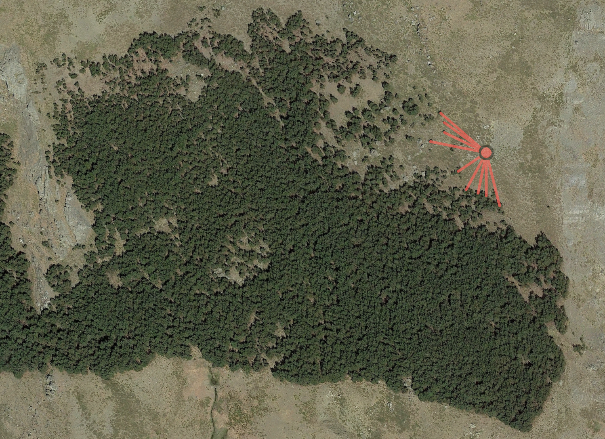
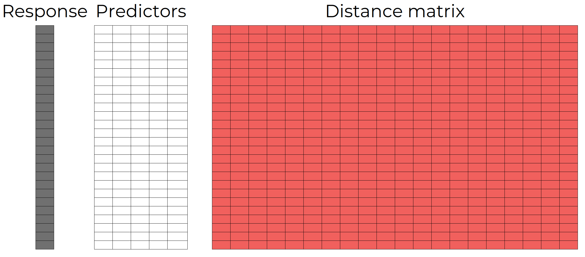
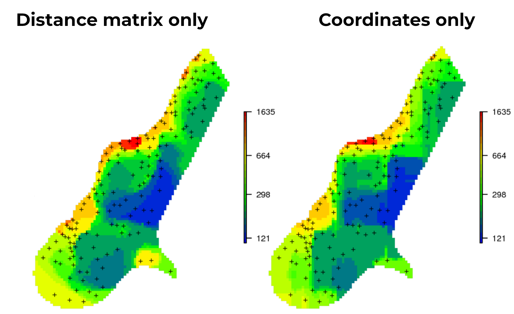
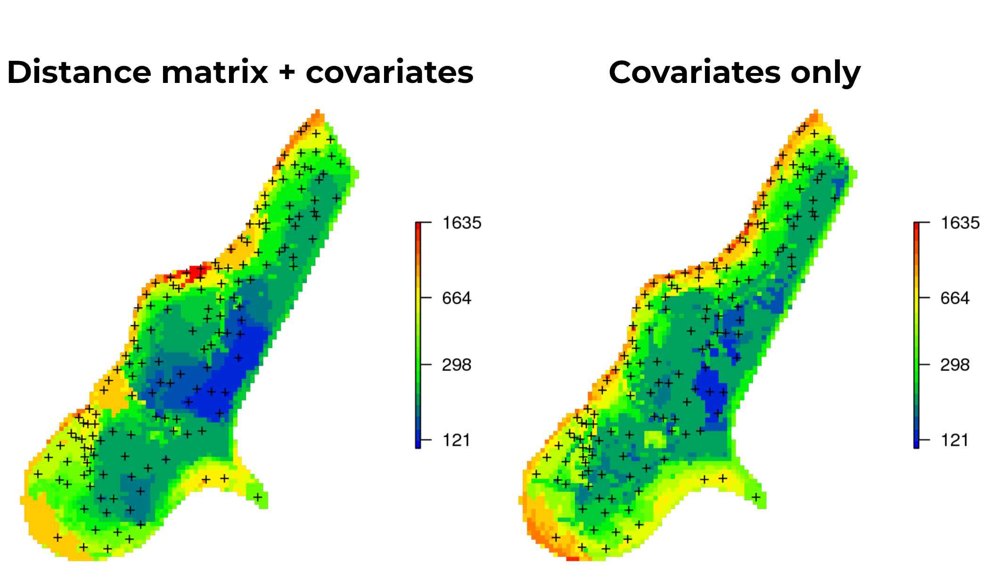
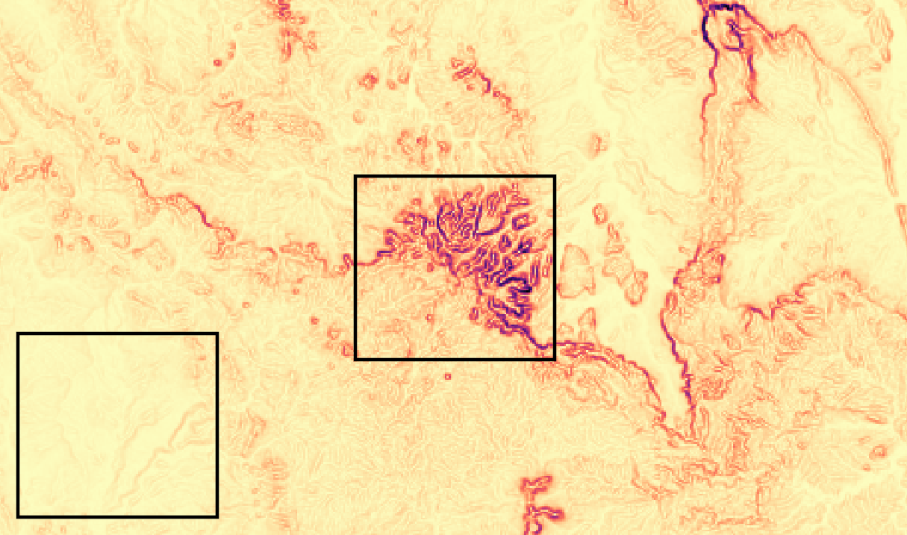

class: center, middle

```{r loadpackages, echo = FALSE, message = FALSE, warning = FALSE}
#required libraries
library(tidyverse)
library(xaringanthemer)
library(patchwork)
library(gstat)
library(raster)
library(geosphere)
library(reshape2)
# remotes::install_github(
#   repo = "blasbenito/spatialRF", 
#   ref = "development",
#   force = TRUE,
#   quiet = TRUE
#   )
library(spatialRF)
```


```{r functions, include=FALSE, warning=FALSE}
source("functions.R")
```


```{r xaringan-themer, include=FALSE, warning=FALSE}
xaringanthemer::style_mono_accent(
  base_color = "#f1605d",
  header_font_google = google_font("Montserrat"),
  text_font_google   = google_font("Montserrat"),
  code_font_google   = google_font("Fira Mono")
)
xaringanExtra::use_tile_view()
# xaringanExtra::use_animate_all("slide_left")
```

```{r setup, include=FALSE}
options(htmltools.dir.version = FALSE)
```

```{css style settings, echo = FALSE}
.blockquote {
    padding: 10px  px;
    margin: 0 0 20px;
    font-size: 150%;
    border-left: 5px solid #f1605d;
}

.large { 
  font-size: 250%;
}

.medium { 
  font-size: 200%;
}

.small { 
  font-size: 150%;
}

.content-box { 
    box-sizing: content-box;
    background-color: #e2e2e2;
  /* Total width: 160px + (2 * 20px) + (2 * 8px) = 216px
     Total height: 80px + (2 * 20px) + (2 * 8px) = 136px
     Content box width: 160px
     Content box height: 80px */;
    border-radius: 15px;
    margin: 0 0 25px;
    overflow: hidden;
    padding: 20px;
    width: 100%;
    background-color: #f1605d;
    font-size: 200%;
    color: white;
}

ul {
  list-style: none; /* Remove default bullets */
}

ul li{
 font-size:150%;
}

ul li::before {
  content: "\02192";  /* Add content: \2022 is the CSS Code/unicode for a bullet */
  color: #f1605d; /* Change the color */
  font-weight: bold; /* If you want it to be bold */
  display: inline-block; /* Needed to add space between the bullet and the text */
  width: 1em; /* Also needed for space (tweak if needed) */
  margin-left: -1em; /* Also needed for space (tweak if needed) */
  font-size: 150%;
}

.remark-slide-content.full-slide-fig {
  padding: 0px 0px 0px 0px;
  width: 100%;
}
```

# Availability

.small[
Github repo with slideshow + code + data are available at <br>
[https://github.com/BlasBenito/spatialRF_talk](https://github.com/BlasBenito/spatialRF_talk)

Slideshow link: [https://blasbenito.github.io/spatialRF_talk/talk.html](https://blasbenito.github.io/spatialRF_talk/talk.html)
]

```{r echo=FALSE, out.height="60%", fig.retina = 2, out.width= "80%"}
knitr::include_graphics("figures/github.png")
```


---
class: inverse, center, middle


#  WHAT IS <br> SPATIAL AUTOCORRELATION <br> AND <br> WHY DO WE CARE?

---
class: center, middle

## Tobler’s First Law of Geography 

.blockquote[
Everything is usually related to all else, but those which are near to each other are more related when compared to those that are further away.
.right[-- <cite>Waldo Tobler, 1970</cite>]
]

<br>

.content-box[Similarity depends on distance]

---
class: middle center

.content-box[Similarity depends on distance]

<br>

.left[

- Effect measured as **spatial autocorrelation** (**SAC**)
- Measured over one or several reference distances
- High similarity over distance: **positive SAC**
- Low similarity over distance: **negative SAC**
- Most popular metric of **SAC** is **Moran's I**

]

---
class: middle center

## Moran's I

.left[

- Slope of record's values versus the distance-weighted values of their neighbors.
- Range between -1 and 1
- Higher than zero: **positive SAC**
- Lower than zero: **negative SAC**

]

---
class: center

```{r, out.width="120%", fig.retina = 2, out.height="60%", message = FALSE, error = FALSE, warning = FALSE, echo = FALSE, results = "hide"}

set.seed(1)

#create grid
xy <- expand.grid(1:20, 1:20)
names(xy) <- c("x", "y")

#create distance matrix
xy.distance <- as.matrix(dist(xy))

#HIGH AUTOCORRELATION

#model
model.positive <- gstat(
  formula = z~1, 
  locations = ~x+y, 
  dummy = T, 
  beta = 1, 
  model = vgm(psill = 0.025, range = 200, model = 'Exp'), 
  nmax = 20
  )

#predict
xy.positive <- predict(
  model.positive, 
  newdata = xy, 
  nsim = 1
  )

#plot
xy.positive.matrix <- ggplot(data = xy.positive) + 
  aes(
    x = x,
    y = y,
    fill = sim1
  ) + 
  geom_tile() + 
  coord_fixed(expand = FALSE) + 
  scale_fill_viridis_c(option = "C", direction = -1) + 
  theme_bw() + 
  labs(x = "", y = "") + 
  theme(
    legend.position = "none", 
    plot.title = element_text(hjust = 0.5)
    ) + 
  ggtitle("1")

#moran
xy.positive.moran <- moran(
  x = xy.positive$sim1,
  distance.matrix = xy.distance,
  distance.threshold = 1
)


#NEUTRAL AUTOCORRELATION

#model
model.neutral <- gstat(
  formula = z~1, 
  locations = ~x+y, 
  dummy = T, 
  beta = 1, 
  model = vgm(psill = 0.025, range = 1, model = 'Exp'), 
  nmax = 20
  )

#predict
xy.neutral <- predict(
  model.neutral, 
  newdata = xy, 
  nsim = 1
  )

#plot
xy.neutral.matrix <- ggplot(data = xy.neutral) + 
  aes(
    x = x,
    y = y,
    fill = sim1
  ) + 
  geom_tile() + 
  coord_fixed(expand = FALSE) + 
  scale_fill_viridis_c(option = "C", direction = -1) + 
  theme_bw() + 
  labs(x = "", y = "") + 
  theme(
    legend.position = "none", 
    plot.title = element_text(hjust = 0.5)
    ) + 
  ggtitle("2")

#moran
xy.neutral.moran <- moran(
  x = xy.neutral$sim1,
  distance.matrix = xy.distance,
  distance.threshold = 1
)

#NEGATIVE AUTOCORRELATION

#values from uniform distribution
xy.negative <- data.frame(
  x = xy$x,
  y = xy$y,
  sim1 = runif(nrow(xy))
)

#plot
xy.negative.matrix <- ggplot(data = xy.negative) + 
  aes(
    x = x,
    y = y,
    fill = sim1
  ) + 
  geom_tile() + 
  coord_fixed(expand = FALSE) + 
  scale_fill_viridis_c(option = "C", direction = -1) + 
  theme_bw() + 
  labs(x = "", y = "") + 
  theme(
    legend.position = "none", 
    plot.title = element_text(hjust = 0.5)
    ) + 
  ggtitle("3")

#moran
xy.negative.moran <- moran(
  x = xy.negative$sim1,
  distance.matrix = xy.distance,
  distance.threshold = 1
)

#final plot
patchwork::wrap_plots(
  list(
    xy.positive.matrix,
    xy.neutral.matrix,
    xy.negative.matrix,
    xy.positive.moran,
    xy.neutral.moran,
    xy.negative.moran
  ),
  ncol = 3
) + plot_annotation(theme = theme(plot.margin = unit(c(0,0,3,0),"cm")))

```

---
class: center middle

```{r, fig.height=9, fig.width=13, fig.retina = 2, message = FALSE, error = FALSE, warning = FALSE, echo = FALSE, results = "hide"}

#gathering Moran's I values over distances for each group
xy.positive.df <- spatialRF::moran_multithreshold(
  x = xy.positive$sim1,
  distance.matrix = xy.distance,
  distance.thresholds = 1:20,
  verbose = FALSE
)$per.distance

xy.positive.df$group <- 1

xy.neutral.df <- spatialRF::moran_multithreshold(
  x = xy.neutral$sim1,
  distance.matrix = xy.distance,
  distance.thresholds = 1:20,
  verbose = FALSE
)$per.distance

xy.neutral.df$group <- 2

xy.negative.df <- spatialRF::moran_multithreshold(
  x = xy.negative$sim1,
  distance.matrix = xy.distance,
  distance.thresholds = 1:20,
  verbose = FALSE
)$per.distance

xy.negative.df$group <- 3

xy.df <- rbind(
  xy.positive.df,
  xy.neutral.df,
  xy.negative.df
)

#plot
xy.df.plot <- ggplot(data = xy.df) +
  aes(
    x = distance.threshold,
    y = moran.i,
    group = as.factor(group),
    color = as.factor(group)
  ) +
  geom_line(size = 2.5) +
  scale_color_viridis_d(option = "C", end = 0.8) +
  scale_x_continuous(breaks = xy.df$distance.threshold) +
  theme_bw(base_size = 30) +
  labs(
    x = "Distance to neighbors", 
    y = "Moran's I",
    title = "Multiscale (or incremental) Moran's I"
  ) +
  theme(
    plot.title = element_text(hjust = 0.5),
    legend.position = "none"
  ) + 
  geom_segment(
    aes(
      x = 2.5,
      y = 0.036,
      xend = 2.5,
      yend = 0.15
    ),
    color = "black"
  ) + 
  geom_segment(
    aes(
      x = 12,
      y = 0,
      xend = 12,
      yend = 0.15
    ),
    color = "black"
  ) + 
  geom_segment(
    aes(
      x = 10,
      y = 0.45,
      xend = 15,
      yend = 0.45
    ),
    color = "black"
  )

#adding insets
xy.df.plot + inset_element(
  xy.positive.matrix +
    theme(
      plot.margin = margin(t = 0, r = 0, b = -15, l = -15),
      axis.ticks = element_blank(),
      axis.text = element_blank(),
      plot.title = element_blank()),
  left = 0.55, bottom = 0.65, right = 0.90, top = 0.95
  ) + 
  inset_element(
  xy.neutral.matrix +
    theme(
      plot.margin = margin(t = 0, r = 0, b = -15, l = -15),
      axis.ticks = element_blank(),
      axis.text = element_blank(),
      plot.title = element_blank()),
  left = 0.00, bottom = 0.15, right = 0.25, top = 0.45
  ) +
  inset_element(
  xy.negative.matrix +
    theme(
      plot.margin = margin(t = 0, r = 0, b = -15, l = -15),
      axis.ticks = element_blank(),
      axis.text = element_blank(),
      plot.title = element_blank()),
  left = 0.45, bottom = 0.10, right = 0.70, top = 0.40
  )
```
```{r, include = FALSE}
#removing objects we don't need
rm(fit, model.neutral, model.positive, xy, xy.df, xy.df.plot, xy.distance, xy.negative, xy.negative.df, xy.negative.matrix, xy.negative.moran, xy.neutral, xy.neutral.df, xy.neutral.matrix, xy.neutral.moran, xy.positive, xy.positive.df, xy.positive.matrix, xy.positive.moran, dojutsu)
```


---
class: center middle

# Most spatial variables <br> show <br> spatial autocorrelation

---
class: center middle

```{r, fig.height=9, fig.width=12, fig.retina = 2, message = FALSE, error = FALSE, warning = FALSE, echo = FALSE, results = "hide"}
#loading raster
x <- raster::raster("data/aridity.tif")
names(x) <- "variable"

#cropping to square
new.extent <- raster::extent(
  c(
    xmin = extent(x)@xmax - (extent(x)@ymax - extent(x)@ymin),
    xmax = extent(x)@xmax,
    ymin = extent(x)@ymin,
    ymax = extent(x)@ymax
  )
)

x <- raster::crop(
  x = x,
  y = new.extent
)

#regular grid over raster file
xy <- raster::sampleRegular(
  x = x, 
  size = 1000,
  xy = TRUE
  ) %>% 
  as.data.frame() %>% 
  dplyr::select(x, y)

#distance matrix
xy.distance <- geosphere::distm(as.matrix(xy), fun = distGeo) / 1000

#extracting values of the raster data
x.values <- raster::extract(
  x = x,
  y = xy,
  df = TRUE
)[, 2]

#autocorrelation
xy.moran.plot <- spatialRF::moran_multithreshold(
  x = x.values,
  distance.matrix = xy.distance,
  distance.thresholds = seq(0, 100, by = 10),
  verbose = FALSE
)$plot + 
  theme_bw(base_size = 25) +
  theme(
    legend.position = "bottom",
    plot.title = element_text(hjust = 0.5)
    ) +
  scale_size_manual(
    breaks = c("< 0.05", ">= 0.05"),
    values = c(5, 10),
    drop = FALSE
  ) + 
  labs(size = "p-value") + 
  scale_y_continuous(limits = c(0, 1)) + 
  scale_fill_viridis_c(option = "C")

#plot map
x.map <- ggplot(data = raster::as.data.frame(x, xy = TRUE)) + 
  geom_tile(
    aes(
      x = x, 
      y = y, 
      fill = variable
    )
  ) + 
  coord_fixed(expand = FALSE) + 
  scale_fill_viridis_c(option = "C") + 
  theme_bw(base_size = 25) + 
  theme(
    legend.position = "bottom", 
    legend.key.width = unit(2,"cm"),
    plot.title = element_text(hjust = 0.5)
  ) + 
  labs(
    fill = "",
    title = "Aridity index",
    x = "Longitude",
    y = "Latitude"
  )

x.map | xy.moran.plot
```


---
class: center middle

```{r, fig.height=9, fig.width=12, fig.retina = 2, message = FALSE, error = FALSE, warning = FALSE, echo = FALSE, results = "hide"}
#loading raster
x <- raster::raster("data/temperature.tif")
names(x) <- "variable"
x <- x/10

#cropping to square
new.extent <- raster::extent(
  c(
    xmin = extent(x)@xmax - (extent(x)@ymax - extent(x)@ymin),
    xmax = extent(x)@xmax,
    ymin = extent(x)@ymin,
    ymax = extent(x)@ymax
  )
)

x <- raster::crop(
  x = x,
  y = new.extent
)

#extracting values of the raster data
x.values <- raster::extract(
  x = x,
  y = xy,
  df = TRUE
)[, 2]

#autocorrelation
xy.moran.plot <- spatialRF::moran_multithreshold(
  x = x.values,
  distance.matrix = xy.distance,
  distance.thresholds = seq(0, 100, by = 10),
  verbose = FALSE
)$plot + 
  theme_bw(base_size = 25) +
  theme(
    legend.position = "bottom",
    plot.title = element_text(hjust = 0.5)
    ) +
  scale_size_manual(
    breaks = c("< 0.05", ">= 0.05"),
    values = c(5, 10),
    drop = FALSE
  ) + 
  labs(size = "p-value") + 
  scale_y_continuous(limits = c(0, 1)) + 
  scale_fill_viridis_c(option = "C")

#plot map
x.map <- ggplot(data = raster::as.data.frame(x, xy = TRUE)) + 
  geom_tile(
    aes(
      x = x, 
      y = y, 
      fill = variable
    )
  ) + 
  coord_fixed(expand = FALSE) + 
  scale_fill_viridis_c(option = "C") + 
  theme_bw(base_size = 25) + 
  theme(
    legend.position = "bottom", 
    legend.key.width = unit(2,"cm"),
    plot.title = element_text(hjust = 0.5)
  ) + 
  labs(
    fill = "",
    title = "Mean temperature",
    x = "Longitude",
    y = "Latitude"
  )

x.map | xy.moran.plot
```

---
class: center middle

```{r, fig.height=9, fig.width=12, fig.retina = 2, message = FALSE, error = FALSE, warning = FALSE, echo = FALSE, results = "hide"}
#loading raster
x <- raster::raster("data/ndvi.tif")
names(x) <- "variable"
x[is.na(x)] <- 0

#cropping to square
new.extent <- raster::extent(
  c(
    xmin = extent(x)@xmax - (extent(x)@ymax - extent(x)@ymin),
    xmax = extent(x)@xmax,
    ymin = extent(x)@ymin,
    ymax = extent(x)@ymax
  )
)

x <- raster::crop(
  x = x,
  y = new.extent
)

#extracting values of the raster data
x.values <- raster::extract(
  x = x,
  y = xy,
  df = TRUE
)[, 2]

#autocorrelation
xy.moran.plot <- spatialRF::moran_multithreshold(
  x = x.values,
  distance.matrix = xy.distance,
  distance.thresholds = seq(0, 100, by = 10),
  verbose = FALSE
)$plot + 
  theme_bw(base_size = 25) +
  theme(
    legend.position = "bottom",
    plot.title = element_text(hjust = 0.5)
    ) +
  scale_size_manual(
    breaks = c("< 0.05", ">= 0.05"),
    values = c(5, 10),
    drop = FALSE
  ) + 
  labs(size = "p-value") + 
  scale_y_continuous(limits = c(0, 1)) + 
  scale_fill_viridis_c(option = "C")

#plot map
x.map <- ggplot(data = raster::as.data.frame(x, xy = TRUE)) + 
  geom_tile(
    aes(
      x = x, 
      y = y, 
      fill = variable
    )
  ) + 
  coord_fixed(expand = FALSE) + 
  scale_fill_viridis_c(option = "C") + 
  theme_bw(base_size = 25) + 
  theme(
    legend.position = "bottom", 
    legend.key.width = unit(2,"cm"),
    plot.title = element_text(hjust = 0.5)
  ) + 
  labs(
    fill = "",
    title = "Vegetation index (NDVI)",
    x = "Longitude",
    y = "Latitude"
  )

x.map | xy.moran.plot
```


---
class: center middle

```{r, fig.height=9, fig.width=12, fig.retina = 2, message = FALSE, error = FALSE, warning = FALSE, echo = FALSE, results = "hide"}
#loading raster
x <- raster::raster("data/accesibility.tif")
names(x) <- "variable"

#cropping to square
new.extent <- raster::extent(
  c(
    xmin = extent(x)@xmax - (extent(x)@ymax - extent(x)@ymin),
    xmax = extent(x)@xmax,
    ymin = extent(x)@ymin,
    ymax = extent(x)@ymax
  )
)

x <- raster::crop(
  x = x,
  y = new.extent
)

#extracting values of the raster data
x.values <- raster::extract(
  x = x,
  y = xy,
  df = TRUE
)[, 2]

#autocorrelation
xy.moran.plot <- spatialRF::moran_multithreshold(
  x = x.values,
  distance.matrix = xy.distance,
  distance.thresholds = seq(0, 100, by = 10),
  verbose = FALSE
)$plot + 
  theme_bw(base_size = 25) +
  theme(
    legend.position = "bottom",
    plot.title = element_text(hjust = 0.5)
    ) +
  scale_size_manual(
    breaks = c("< 0.05", ">= 0.05"),
    values = c(5, 10),
    drop = FALSE
  ) + 
  labs(size = "p-value") + 
  scale_y_continuous(limits = c(0, 1)) + 
  scale_fill_viridis_c(option = "C")

#plot map
x.map <- ggplot(data = raster::as.data.frame(x, xy = TRUE)) + 
  geom_tile(
    aes(
      x = x, 
      y = y, 
      fill = variable
    )
  ) + 
  coord_fixed(expand = FALSE) + 
  scale_fill_viridis_c(option = "C") + 
  theme_bw(base_size = 25) + 
  theme(
    legend.position = "bottom", 
    legend.key.width = unit(2,"cm"),
    plot.title = element_text(hjust = 0.5)
  ) + 
  labs(
    fill = "",
    title = "Accesibility",
    x = "Longitude",
    y = "Latitude"
  )

x.map | xy.moran.plot
```

---
class: center middle

```{r, fig.height=9, fig.width=12, fig.retina = 2, message = FALSE, error = FALSE, warning = FALSE, echo = FALSE, results = "hide"}
#loading raster
x <- raster::raster("data/human_footprint.tif")
names(x) <- "variable"

#cropping to square
new.extent <- raster::extent(
  c(
    xmin = extent(x)@xmax - (extent(x)@ymax - extent(x)@ymin),
    xmax = extent(x)@xmax,
    ymin = extent(x)@ymin,
    ymax = extent(x)@ymax
  )
)

x <- raster::crop(
  x = x,
  y = new.extent
)

#extracting values of the raster data
x.values <- raster::extract(
  x = x,
  y = xy,
  df = TRUE
)[, 2]

#autocorrelation
xy.moran.plot <- spatialRF::moran_multithreshold(
  x = x.values,
  distance.matrix = xy.distance,
  distance.thresholds = seq(0, 100, by = 10),
  verbose = FALSE
)$plot + 
  theme_bw(base_size = 25) +
  theme(
    legend.position = "bottom",
    plot.title = element_text(hjust = 0.5)
    ) +
  scale_size_manual(
    breaks = c("< 0.05", ">= 0.05"),
    values = c(5, 10),
    drop = FALSE
  ) + 
  labs(size = "p-value") + 
  scale_y_continuous(limits = c(0, 1)) + 
  scale_fill_viridis_c(option = "C")

#plot map
x.map <- ggplot(data = raster::as.data.frame(x, xy = TRUE)) + 
  geom_tile(
    aes(
      x = x, 
      y = y, 
      fill = variable
    )
  ) + 
  coord_fixed(expand = FALSE) + 
  scale_fill_viridis_c(option = "C") + 
  theme_bw(base_size = 25) + 
  theme(
    legend.position = "bottom", 
    legend.key.width = unit(2,"cm"),
    plot.title = element_text(hjust = 0.5)
  ) + 
  labs(
    fill = "",
    title = "Human footprint",
    x = "Longitude",
    y = "Latitude"
  )

x.map | xy.moran.plot
```


---
class: center middle

```{r, fig.height=9, fig.width=12, fig.retina = 2, message = FALSE, error = FALSE, warning = FALSE, echo = FALSE, results = "hide"}
#loading raster
x <- raster::raster("data/slope.tif")
names(x) <- "variable"

#cropping to square
new.extent <- raster::extent(
  c(
    xmin = extent(x)@xmax - (extent(x)@ymax - extent(x)@ymin),
    xmax = extent(x)@xmax,
    ymin = extent(x)@ymin,
    ymax = extent(x)@ymax
  )
)

x <- raster::crop(
  x = x,
  y = new.extent
)

#extracting values of the raster data
x.values <- raster::extract(
  x = x,
  y = xy,
  df = TRUE
)[, 2]

#autocorrelation
xy.moran.plot <- spatialRF::moran_multithreshold(
  x = x.values,
  distance.matrix = xy.distance,
  distance.thresholds = seq(0, 100, by = 10),
  verbose = FALSE
)$plot + 
  theme_bw(base_size = 25) +
  theme(
    legend.position = "bottom",
    plot.title = element_text(hjust = 0.5)
    ) +
  scale_size_manual(
    breaks = c("< 0.05", ">= 0.05"),
    values = c(5, 10),
    drop = FALSE
  ) + 
  labs(size = "p-value") + 
  scale_y_continuous(limits = c(0, 1)) + 
  scale_fill_viridis_c(option = "C")

#plot map
x.map <- ggplot(data = raster::as.data.frame(x, xy = TRUE)) + 
  geom_tile(
    aes(
      x = x, 
      y = y, 
      fill = variable
    )
  ) + 
  coord_fixed(expand = FALSE) + 
  scale_fill_viridis_c(option = "C") + 
  theme_bw(base_size = 25) + 
  theme(
    legend.position = "bottom", 
    legend.key.width = unit(2,"cm"),
    plot.title = element_text(hjust = 0.5)
  ) + 
  labs(
    fill = "",
    title = "Topographic slope",
    x = "Longitude",
    y = "Latitude"
  )

x.map | xy.moran.plot
```

---
class: center, middle

## So far we know that:

.left[

- **Similarity depends on distance**
- We measure it as **spatial autocorrelation**

]

.medium[
But...
]

.content-box[...what does SAC *really* represent?]

---
class: center, middle

## Spatial autocorrelation <br> often represents <br> the *footprint* <br> of the process generating <br> the variable of interest!

---
class: center

## Cholera map (John Snow<sup>1</sup>, 1854)

```{r echo=FALSE, out.width="60%", out.height="60%"}
knitr::include_graphics("figures/cholera.jpg")
```

.small[
.footnote[
[1] Not *that* John Snow
]
]

---
class: center

## Cholera map (John Snow<sup>1</sup>, 1854)

```{r echo=FALSE, out.width="60%", out.height="60%"}
knitr::include_graphics("figures/cholera2.jpg")
```

.small[
.footnote[
[1] Not *that* John Snow
]
]

---
class: center

## Colony of Imperial cormorants <br> (*Leucocarbo atriceps*)


```{r echo=FALSE, out.width="90%", out.height="60%"}
knitr::include_graphics("figures/cormorants.jpeg")
```

.small[

Source: [www.dailymail.co.uk](https://www.dailymail.co.uk/news/article-2982830/Amazing-photographs-thousands-nesting-Cormorants-gather-crowded-beach-annual-nesting-season.html)

]

---
class: center

## Colony of Imperial cormorants <br> (*Leucocarbo atriceps*)


```{r echo=FALSE, out.width="90%", out.height="60%"}
knitr::include_graphics("figures/cormorants2.jpeg")
```

.small[

Source: [www.dailymail.co.uk](https://www.dailymail.co.uk/news/article-2982830/Amazing-photographs-thousands-nesting-Cormorants-gather-crowded-beach-annual-nesting-season.html)

]

---
class: center

## *Quercus pyrenaica* forest


```{r echo=FALSE, out.width="90%", out.height="60%"}

```

---
class: center

## *Quercus pyrenaica* forest


```{r echo=FALSE, out.width="90%", out.height="60%"}

```


---
class: center

## Mammal's richness


```{r, fig.height=9, fig.width=13, fig.retina = 2, message = FALSE, error = FALSE, warning = FALSE, echo = FALSE, results = "hide"}
ggplot(
  data = raster::raster("data/mammals.tif") %>% 
  raster::as.data.frame(xy = TRUE)
  ) + 
  geom_tile(
    aes(
      x = x, 
      y = y, 
      fill = mammals
    )
  ) + 
  coord_fixed(expand = FALSE) + 
  scale_fill_viridis_c(option = "C", direction = -1) + 
  theme_bw(base_size = 25) + 
  theme(
    legend.position = "bottom", 
    legend.key.width = unit(2,"cm"),
    plot.title = element_text(hjust = 0.5)
  ) + 
  labs(
    fill = "",
    x = "Longitude",
    y = "Latitude",
    caption = "sedac.ciesin.columbia.edu"
  )

```

---
class: inverse middle center

# ACCOUNTING FOR <br> SPATIAL AUTOCORRELATION <br> WITH RANDOM FOREST

---
class: middle center

## SPATIAL PREDICTORS

.medium[
**Predictors representing distances among records**
]

.left[

- Columns of the distance matrix
- Eigenvectors of the distance matrix (also *eigenvector spatial filtering*)

]

---
class: middle center

## COLUMNS OF THE <br> DISTANCE MATRIX

```{r echo=FALSE, out.width="90%", out.height="60%"}

```

---
class: middle center

## COLUMNS OF THE <br> DISTANCE MATRIX

.small[Approach named **RFsp** (Hengl *et al.* 2018)]

```{r echo=FALSE, out.width="90%", out.height="60%"}

```

---
class: middle center

## COLUMNS OF THE <br> DISTANCE MATRIX

Authors compare **RFsp** with several alternatives

```{r echo=FALSE, out.width="90%", out.height="60%"}

```

---
class: middle center

## COLUMNS OF THE <br> DISTANCE MATRIX

Authors compare **RFsp** with several alternatives

```{r echo=FALSE, out.width="90%", out.height="60%"}

```


---
class: middle left

## PROS

- Easy to apply and understand
- As good as geostatistics (kriging)
- Removes spatial autocorrelation of model residuals
- Importance scores of distance columns easy to interpret


---
class: middle left

## CONS

- Model training can be computationally expensive
- Limit in number of records depends on the RAM memory available
- Model is hard to generalize outside of the training universe (especially when the sampling is irregular)


---
class: middle center

## EIGENVECTORS OF THE DISTANCE MATRIX

.small[
Case locations
]

```{r echo=FALSE, out.width="50%", out.height="40%"}
#creating the pairs of coordinates
xy <- expand.grid(
  x = 1:5,
  y = 1:5
)

ggplot(data = xy) + 
  aes(
    x = x,
    y = y
  ) + 
  geom_point(color = "#f1605d", size = 10) + 
  theme_bw(base_size = 30) + 
  coord_fixed()
```

---
class: middle center

## EIGENVECTORS OF THE DISTANCE MATRIX

.small[
Distance matrix
]

```{r echo=FALSE, out.width="60%", out.height="60%"}
#creating the distance matrix
xy.distances <- dist(
  xy, 
  diag = TRUE, 
  upper = TRUE
  ) %>% 
  as.matrix()

ggplot(data = reshape2::melt(xy.distances)) + 
  aes(
    x = Var1,
    y = Var2,
    fill = value
  ) + 
  geom_tile() + 
  theme_bw(base_size = 20) + 
  scale_fill_viridis_c(option = "C", direction = -1) + 
  coord_fixed(expand = FALSE) + 
  labs(fill = "Distance", x = "Observation", y = "Observation") +
  theme(plot.margin = unit(c(0,0,3,0),"cm"))
```

---
class: middle center

## EIGENVECTORS OF THE DISTANCE MATRIX

.small[
Matrix of weights
]

```{r echo=FALSE, out.width="60%", out.height="60%"}
#thresholdding and weights
xy.distances[xy.distances <= 1] <- 1
diag(xy.distances) <- NA
xy.weights <- 1/xy.distances

ggplot(data = reshape2::melt(xy.weights)) + 
  aes(
    x = Var1,
    y = Var2,
    fill = value
  ) + 
  geom_tile() + 
  theme_bw(base_size = 20) + 
  scale_fill_viridis_c(option = "C", direction = -1) + 
  coord_fixed(expand = FALSE) + 
  labs(fill = "Weight", x = "Observation", y = "Observation") +
  theme(plot.margin = unit(c(0,0,3,0),"cm"))
```

---
class: middle center

## EIGENVECTORS OF THE DISTANCE MATRIX

.small[
Weights normalized by rowsums
]

```{r echo=FALSE, out.width="65%", out.height="65%"}
#normalizing weights
xy.weights.rowsums <- rowSums(
  xy.weights,
  na.rm = TRUE
  )
xy.weights <- xy.weights/xy.weights.rowsums

#removing Inf
xy.weights[xy.weights == Inf] <- 0

#adding zero to diagonals
diag(xy.weights) <- 0

ggplot(data = reshape2::melt(xy.weights)) + 
  aes(
    x = Var1,
    y = Var2,
    fill = value
  ) + 
  geom_tile() + 
  theme_bw(base_size = 20) + 
  scale_fill_viridis_c(option = "C", direction = -1) + 
  coord_fixed(expand = FALSE) + 
  labs(fill = "Normalized \n weight", x = "Observation", y = "Observation") +
  theme(plot.margin = unit(c(0,0,3,0),"cm"))
```

---
class: middle center

## EIGENVECTORS OF THE DISTANCE MATRIX

.small[
Double-centering
]

```{r echo=FALSE, out.width="60%", out.height="60%"}
#double centering weights matrix

#compute row means
xy.weights.row.means <- xy.weights*0 + rowMeans(xy.weights)

#compute col means
xy.weights.col.means <- t(xy.weights*0 + colMeans(xy.weights))

#double centering
xy.weights.double.centered <- (xy.weights - xy.weights.row.means - xy.weights.col.means + mean(xy.weights[]))

#adding zero to diagonals
diag(xy.weights.double.centered) <- 0

ggplot(data = reshape2::melt(xy.weights.double.centered)) + 
  aes(
    x = Var1,
    y = Var2,
    fill = value
  ) + 
  geom_tile() + 
  theme_bw(base_size = 20) + 
  scale_fill_viridis_c(option = "C", direction = -1) + 
  coord_fixed(expand = FALSE) + 
  labs(fill = "Double \n centered \n weights", x = "Observation", y = "Observation") +
  theme(plot.margin = unit(c(0,0,3,0),"cm"))
```

## EIGENVECTORS OF THE DISTANCE MATRIX

.small[
Computation of normalized eigenvectors
]

```{r echo=FALSE, out.width="100%", out.height="60%"}
#eigenvalues and eigenvectors
xy.eigen <- eigen(
  xy.weights.double.centered,
  symmetric = TRUE
)

ggplot(data = cbind(
  xy, 
  xy.eigen$vectors
  ) %>% 
    tidyr::pivot_longer(
      cols = 3:27, 
      names_to = "eigenvector",
      values_to = "value"
      ) %>% 
    dplyr::mutate(eigenvector = factor(eigenvector, levels = as.character(1:25)))
  ) + 
  aes(
    x = x,
    y = y, 
    fill = value,
    group = eigenvector
  ) +
  facet_wrap("eigenvector", ncol = 7) + 
  geom_tile() + 
  coord_cartesian(expand = FALSE) + 
  scale_fill_gradient2(
    midpoint = 0, 
    low = "#fba437", 
    mid = "white", 
    high = "#131789"
    ) + 
  labs(x = "", y = "", fill = "Value") + 
  theme(strip.background = element_rect(colour = "black", fill = "white")) + 
  theme_bw(base_size = 20) +
  theme(plot.margin = unit(c(0,0,3,0),"cm"))
```

## EIGENVECTORS OF THE DISTANCE MATRIX

.medium[
Ranking eigenvectors with positive eigenvalue and Moran's I > 0
]

```{r echo=FALSE, out.width="100%", out.height="60%"}
#normalize eigenvalues
xy.eigenvalues <- xy.eigen$values/max(abs(xy.eigen$values))

#get positive mem (all of them have positive values)
xy.positive.eigenvectors <- as.data.frame(xy.eigen$vectors[, which(xy.eigenvalues > 0)])

#rank by Moran's I
xy.selected.eigenvectors <- spatialRF::rank_spatial_predictors(
  distance.matrix = xy.distances,
  distance.thresholds = 0,
  spatial.predictors.df = xy.positive.eigenvectors,
  ranking.method = "moran"
  )

#preparing plotting dataframe
plot.df <- cbind(
  xy, 
  xy.selected.eigenvectors$spatial.predictors.df
  ) 
colnames(plot.df) <- c(
  "x", "y", 
  paste0(
    "Moran's I = ", 
    round(xy.selected.eigenvectors$criteria$ranking.criteria, 3)
    )
  )

plot.df <- plot.df %>% 
  tidyr::pivot_longer(
      cols = 3:7, 
      names_to = "eigenvector",
      values_to = "value"
      ) %>% 
    dplyr::mutate(eigenvector = factor(eigenvector, levels = paste0(
    "Moran's I = ", 
    round(xy.selected.eigenvectors$criteria$ranking.criteria, 3)
    )))

ggplot(data = plot.df
  ) + 
  aes(
    x = x,
    y = y, 
    fill = value,
    group = eigenvector
  ) +
  facet_wrap("eigenvector", ncol = 3) + 
  geom_tile() + 
  coord_cartesian(expand = FALSE) + 
  scale_fill_gradient2(
    midpoint = 0, 
    low = "#fba437", 
    mid = "white", 
    high = "#131789"
    ) + 
  labs(x = "", y = "", fill = "Value") + 
  theme(strip.background = element_rect(colour = "black", fill = "white")) + 
  theme_bw(base_size = 20) +
  theme(plot.margin = unit(c(0,0,3,0),"cm"))
```


---
class: middle center

## EIGENVECTORS OF THE DISTANCE MATRIX

```{r echo=FALSE, out.width="90%", out.height="60%"}
knitr::include_graphics("figures/eigenvectors.png")
```


---
class: center, middle

## Topographic slope

```{r echo=FALSE, out.height="60%", out.width= "100%"}

```

---
class: center, middle

## Topographic slope

```{r echo=FALSE, out.height="60%", out.width= "100%"}
knitr::include_graphics("figures/slope_ab.png")
```

---

# Hello World

Install the **xaringan** package from [Github](https://github.com/yihui/xaringan):

```{r eval=FALSE, tidy=FALSE}
remotes::install_github("yihui/xaringan")
```

--

You are recommended to use the [RStudio IDE](https://www.rstudio.com/products/rstudio/), but you do not have to.

- Create a new R Markdown document from the menu `File -> New File -> R Markdown -> From Template -> Ninja Presentation`;<sup>1</sup>

--

- Click the `Knit` button to compile it;

--

- or use the [RStudio Addin](https://rstudio.github.io/rstudioaddins/)<sup>2</sup> "Infinite Moon Reader" to live preview the slides (every time you update and save the Rmd document, the slides will be automatically reloaded in RStudio Viewer.

.footnote[
[1] 中文用户请看[这份教程](https://slides.yihui.org/xaringan/zh-CN.html)

[2] See [#2](https://github.com/yihui/xaringan/issues/2) if you do not see the template or addin in RStudio.
]


# Hello Ninja

As a presentation ninja, you certainly should not be satisfied by the "Hello World" example. You need to understand more about two things:

1. The [remark.js](https://remarkjs.com) library;

1. The **xaringan** package;

Basically **xaringan** injected the chakra of R Markdown (minus Pandoc) into **remark.js**. The slides are rendered by remark.js in the web browser, and the Markdown source needed by remark.js is generated from R Markdown (**knitr**).

---

# remark.js

You can see an introduction of remark.js from [its homepage](https://remarkjs.com). You should read the [remark.js Wiki](https://github.com/gnab/remark/wiki) at least once to know how to

- create a new slide (Markdown syntax<sup>*</sup> and slide properties);

- format a slide (e.g. text alignment);

- configure the slideshow;

- and use the presentation (keyboard shortcuts).

It is important to be familiar with remark.js before you can understand the options in **xaringan**.

.footnote[[*] It is different with Pandoc's Markdown! It is limited but should be enough for presentation purposes. Come on... You do not need a slide for the Table of Contents! Well, the Markdown support in remark.js [may be improved](https://github.com/gnab/remark/issues/142) in the future.]

---
background-image: url(`r xaringan:::karl`)
background-size: cover
class: center, bottom, inverse

# I was so happy to have discovered remark.js!

---
class: inverse, middle, center

# Using xaringan

---

# xaringan

Provides an R Markdown output format `xaringan::moon_reader` as a wrapper for remark.js, and you can use it in the YAML metadata, e.g.

```yaml
---
title: "A Cool Presentation"
output:
  xaringan::moon_reader:
    yolo: true
    nature:
      autoplay: 30000
---
```

See the help page `?xaringan::moon_reader` for all possible options that you can use.

---

# remark.js vs xaringan

Some differences between using remark.js (left) and using **xaringan** (right):

.pull-left[
1. Start with a boilerplate HTML file;

1. Plain Markdown;

1. Write JavaScript to autoplay slides;

1. Manually configure MathJax;

1. Highlight code with `*`;

1. Edit Markdown source and refresh browser to see updated slides;
]

.pull-right[
1. Start with an R Markdown document;

1. R Markdown (can embed R/other code chunks);

1. Provide an option `autoplay`;

1. MathJax just works;<sup>*</sup>

1. Highlight code with `{{}}`;

1. The RStudio addin "Infinite Moon Reader" automatically refreshes slides on changes;
]

.footnote[[*] Not really. See next page.]

---

# Math Expressions

You can write LaTeX math expressions inside a pair of dollar signs, e.g. &#36;\alpha+\beta$ renders $\alpha+\beta$. You can use the display style with double dollar signs:

```
$$\bar{X}=\frac{1}{n}\sum_{i=1}^nX_i$$
```

$$\bar{X}=\frac{1}{n}\sum_{i=1}^nX_i$$

Limitations:

1. The source code of a LaTeX math expression must be in one line, unless it is inside a pair of double dollar signs, in which case the starting `$$` must appear in the very beginning of a line, followed immediately by a non-space character, and the ending `$$` must be at the end of a line, led by a non-space character;

1. There should not be spaces after the opening `$` or before the closing `$`.

1. Math does not work on the title slide (see [#61](https://github.com/yihui/xaringan/issues/61) for a workaround).

---

# R Code

```{r comment='#'}
# a boring regression
fit = lm(dist ~ 1 + speed, data = cars)
coef(summary(fit))
dojutsu = c('地爆天星', '天照', '加具土命', '神威', '須佐能乎', '無限月読')
grep('天', dojutsu, value = TRUE)
```

---

# R Plots

```{r cars, fig.height=4, dev='svg'}
par(mar = c(4, 4, 1, .1))
plot(cars, pch = 19, col = 'darkgray', las = 1)
abline(fit, lwd = 2)
```

---

# Tables

If you want to generate a table, make sure it is in the HTML format (instead of Markdown or other formats), e.g.,

```{r}
knitr::kable(head(iris), format = 'html')
```

---

# HTML Widgets

I have not thoroughly tested HTML widgets against **xaringan**. Some may work well, and some may not. It is a little tricky.

Similarly, the Shiny mode (`runtime: shiny`) does not work. I might get these issues fixed in the future, but these are not of high priority to me. I never turn my presentation into a Shiny app. When I need to demonstrate more complicated examples, I just launch them separately. It is convenient to share slides with other people when they are plain HTML/JS applications.

See the next page for two HTML widgets.

---

```{r out.width='100%', fig.height=6, eval=require('leaflet')}
library(leaflet)
leaflet() %>% addTiles() %>% setView(-93.65, 42.0285, zoom = 17)
```

---

```{r eval=require('DT'), tidy=FALSE}
DT::datatable(
  head(iris, 10),
  fillContainer = FALSE, options = list(pageLength = 8)
)
```

---

# Some Tips

- Do not forget to try the `yolo` option of `xaringan::moon_reader`.

    ```yaml
    output:
      xaringan::moon_reader:
        yolo: true
    ```

---

# Some Tips

- Slides can be automatically played if you set the `autoplay` option under `nature`, e.g. go to the next slide every 30 seconds in a lightning talk:

    ```yaml
    output:
      xaringan::moon_reader:
        nature:
          autoplay: 30000
    ```

- If you want to restart the play after it reaches the last slide, you may set the sub-option `loop` to TRUE, e.g.,

    ```yaml
    output:
      xaringan::moon_reader:
        nature:
          autoplay:
            interval: 30000
            loop: true
    ```

---

# Some Tips

- A countdown timer can be added to every page of the slides using the `countdown` option under `nature`, e.g. if you want to spend one minute on every page when you give the talk, you can set:

    ```yaml
    output:
      xaringan::moon_reader:
        nature:
          countdown: 60000
    ```

    Then you will see a timer counting down from `01:00`, to `00:59`, `00:58`, ... When the time is out, the timer will continue but the time turns red.
    
---

# Some Tips

- The title slide is created automatically by **xaringan**, but it is just another remark.js slide added before your other slides.

    The title slide is set to `class: center, middle, inverse, title-slide` by default. You can change the classes applied to the title slide with the `titleSlideClass` option of `nature` (`title-slide` is always applied).

    ```yaml
    output:
      xaringan::moon_reader:
        nature:
          titleSlideClass: [top, left, inverse]
    ```
    
--

- If you'd like to create your own title slide, disable **xaringan**'s title slide with the `seal = FALSE` option of `moon_reader`.

    ```yaml
    output:
      xaringan::moon_reader:
        seal: false
    ```

---

# Some Tips

- There are several ways to build incremental slides. See [this presentation](https://slides.yihui.org/xaringan/incremental.html) for examples.

- The option `highlightLines: true` of `nature` will highlight code lines that start with `*`, or are wrapped in `{{ }}`, or have trailing comments `#<<`;

    ```yaml
    output:
      xaringan::moon_reader:
        nature:
          highlightLines: true
    ```

    See examples on the next page.

---

# Some Tips


.pull-left[
An example using a leading `*`:

    ```r
    if (TRUE) {
    ** message("Very important!")
    }
    ```
Output:
```r
if (TRUE) {
* message("Very important!")
}
```

This is invalid R code, so it is a plain fenced code block that is not executed.
]

.pull-right[
An example using `{{}}`:

````
`r ''````{r tidy=FALSE}
if (TRUE) {
*{{ message("Very important!") }}
}
```
````
Output:
```{r tidy=FALSE}
if (TRUE) {
{{ message("Very important!") }}
}
```

It is valid R code so you can run it. Note that `{{}}` can wrap an R expression of multiple lines.
]

---

# Some Tips

An example of using the trailing comment `#<<` to highlight lines:

````markdown
`r ''````{r tidy=FALSE}
library(ggplot2)
ggplot(mtcars) + 
  aes(mpg, disp) + 
  geom_point() +   #<<
  geom_smooth()    #<<
```
````

Output:

```{r tidy=FALSE, eval=FALSE}
library(ggplot2)
ggplot(mtcars) + 
  aes(mpg, disp) + 
  geom_point() +   #<<
  geom_smooth()    #<<
```

---

# Some Tips

When you enable line-highlighting, you can also use the chunk option `highlight.output` to highlight specific lines of the text output from a code chunk. For example, `highlight.output = TRUE` means highlighting all lines, and `highlight.output = c(1, 3)` means highlighting the first and third line.

````md
`r ''````{r, highlight.output=c(1, 3)}
head(iris)
```
````

```{r, highlight.output=c(1, 3), echo=FALSE}
head(iris)
```

Question: what does `highlight.output = c(TRUE, FALSE)` mean? (Hint: think about R's recycling of vectors)

---

# Some Tips

- To make slides work offline, you need to download a copy of remark.js in advance, because **xaringan** uses the online version by default (see the help page `?xaringan::moon_reader`).

- You can use `xaringan::summon_remark()` to download the latest or a specified version of remark.js. By default, it is downloaded to `libs/remark-latest.min.js`.

- Then change the `chakra` option in YAML to point to this file, e.g.

    ```yaml
    output:
      xaringan::moon_reader:
        chakra: libs/remark-latest.min.js
    ```

- If you used Google fonts in slides (the default theme uses _Yanone Kaffeesatz_, _Droid Serif_, and _Source Code Pro_), they won't work offline unless you download or install them locally. The Heroku app [google-webfonts-helper](https://google-webfonts-helper.herokuapp.com/fonts) can help you download fonts and generate the necessary CSS.

---

# Macros

- remark.js [allows users to define custom macros](https://github.com/yihui/xaringan/issues/80) (JS functions) that can be applied to Markdown text using the syntax `![:macroName arg1, arg2, ...]` or ``. For example, before remark.js initializes the slides, you can define a macro named `scale`:

    ```js
    remark.macros.scale = function (percentage) {
      var url = this;
      return '';
    };
    ```

    Then the Markdown text

    ```markdown
    
    ```

    will be translated to
    
    ```html
    
    ```

---

# Macros (continued)

- To insert macros in **xaringan** slides, you can use the option `beforeInit` under the option `nature`, e.g.,

    ```yaml
    output:
      xaringan::moon_reader:
        nature:
          beforeInit: "macros.js"
    ```

    You save your remark.js macros in the file `macros.js`.

- The `beforeInit` option can be used to insert arbitrary JS code before `remark.create()`. Inserting macros is just one of its possible applications.

---

# CSS

Among all options in `xaringan::moon_reader`, the most challenging but perhaps also the most rewarding one is `css`, because it allows you to customize the appearance of your slides using any CSS rules or hacks you know.

You can see the default CSS file [here](https://github.com/yihui/xaringan/blob/master/inst/rmarkdown/templates/xaringan/resources/default.css). You can completely replace it with your own CSS files, or define new rules to override the default. See the help page `?xaringan::moon_reader` for more information.

---

# CSS

For example, suppose you want to change the font for code from the default "Source Code Pro" to "Ubuntu Mono". You can create a CSS file named, say, `ubuntu-mono.css`:

```css
@import url(https://fonts.googleapis.com/css?family=Ubuntu+Mono:400,700,400italic);

.remark-code, .remark-inline-code { font-family: 'Ubuntu Mono'; }
```

Then set the `css` option in the YAML metadata:

```yaml
output:
  xaringan::moon_reader:
    css: ["default", "ubuntu-mono.css"]
```

Here I assume `ubuntu-mono.css` is under the same directory as your Rmd.

See [yihui/xaringan#83](https://github.com/yihui/xaringan/issues/83) for an example of using the [Fira Code](https://github.com/tonsky/FiraCode) font, which supports ligatures in program code.

---

# CSS (with Sass)

**xaringan** also supports Sass support via **rmarkdown**. Suppose you want to use the same color for different elements, e.g., first heading and bold text. You can create a `.scss` file, say `mytheme.scss`, using the [sass](https://sass-lang.com/) syntax with variables:

```scss
$mycolor: #ff0000; 
.remark-slide-content > h1 { color: $mycolor; }
.remark-slide-content strong { color: $mycolor; }
```

Then set the `css` option in the YAML metadata using this file placed under the same directory as your Rmd:

```yaml
output:
  xaringan::moon_reader:
    css: ["default", "mytheme.scss"]
```

This requires **rmarkdown** >= 2.8 and the [**sass**](https://rstudio.github.io/sass/) package. You can learn more about **rmarkdown** and **sass** support in [this blog post](https://blog.rstudio.com/2021/04/15/2021-spring-rmd-news/#sass-and-scss-support-for-html-based-output) and in [**sass** overview vignette](https://rstudio.github.io/sass/articles/sass.html).

---

# Themes

Don't want to learn CSS? Okay, you can use some user-contributed themes. A theme typically consists of two CSS files `foo.css` and `foo-fonts.css`, where `foo` is the theme name. Below are some existing themes:

```{r, R.options=list(width = 70)}
names(xaringan:::list_css())
```

---

# Themes

To use a theme, you can specify the `css` option as an array of CSS filenames (without the `.css` extensions), e.g.,

```yaml
output:
  xaringan::moon_reader:
    css: [default, metropolis, metropolis-fonts]
```

If you want to contribute a theme to **xaringan**, please read [this blog post](https://yihui.org/en/2017/10/xaringan-themes).

---
class: inverse, middle, center
background-image: url(https://upload.wikimedia.org/wikipedia/commons/3/39/Naruto_Shiki_Fujin.svg)
background-size: contain

# Naruto

---
background-image: url(https://upload.wikimedia.org/wikipedia/commons/b/be/Sharingan_triple.svg)
background-size: 100px
background-position: 90% 8%

# Sharingan

The R package name **xaringan** was derived<sup>1</sup> from **Sharingan**, a dōjutsu in the Japanese anime _Naruto_ with two abilities:

- the "Eye of Insight"

- the "Eye of Hypnotism"

I think a presentation is basically a way to communicate insights to the audience, and a great presentation may even "hypnotize" the audience.<sup>2,3</sup>

.footnote[
[1] In Chinese, the pronounciation of _X_ is _Sh_ /ʃ/ (as in _shrimp_). Now you should have a better idea of how to pronounce my last name _Xie_.

[2] By comparison, bad presentations only put the audience to sleep.

[3] Personally I find that setting background images for slides is a killer feature of remark.js. It is an effective way to bring visual impact into your presentations.
]

---

# Naruto terminology

The **xaringan** package borrowed a few terms from Naruto, such as

- [Sharingan](https://naruto.fandom.com/wiki/Sharingan) (写輪眼; the package name)

- The [moon reader](https://naruto.fandom.com/wiki/Moon_Reader) (月読; an attractive R Markdown output format)

- [Chakra](https://naruto.fandom.com/wiki/Chakra) (查克拉; the path to the remark.js library, which is the power to drive the presentation)

- [Nature transformation](https://naruto.fandom.com/wiki/Nature_Transformation) (性質変化; transform the chakra by setting different options)

- The [infinite moon reader](https://naruto.fandom.com/wiki/Infinite_Tsukuyomi) (無限月読; start a local web server to continuously serve your slides)

- The [summoning technique](https://naruto.fandom.com/wiki/Summoning_Technique) (download remark.js from the web)

You can click the links to know more about them if you want. The jutsu "Moon Reader" may seem a little evil, but that does not mean your slides are evil.

---

class: center

# Hand seals (印)

Press `h` or `?` to see the possible ninjutsu you can use in remark.js.


---

class: center, middle

# Thanks!

Slides created via the R package [**xaringan**](https://github.com/yihui/xaringan).

The chakra comes from [remark.js](https://remarkjs.com), [**knitr**](https://yihui.org/knitr/), and [R Markdown](https://rmarkdown.rstudio.com).
