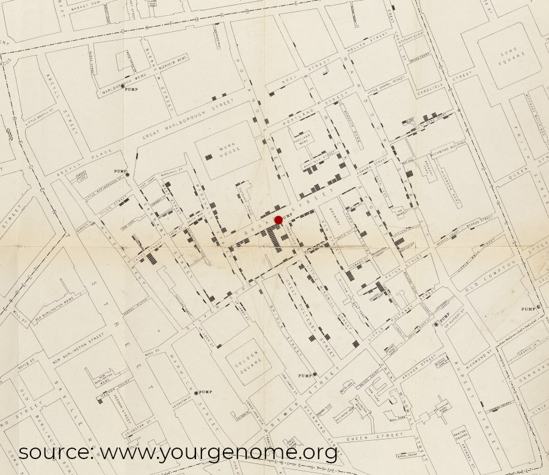
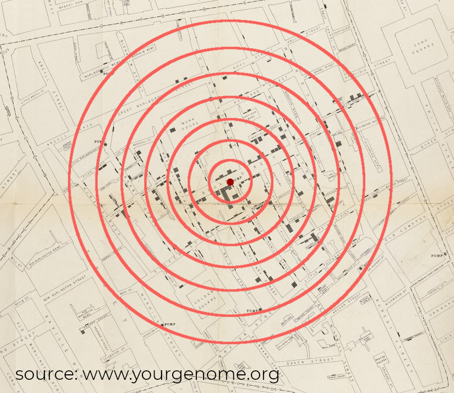
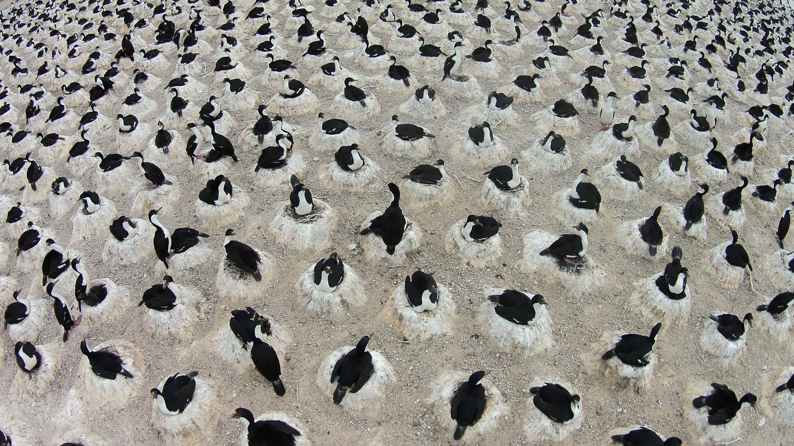
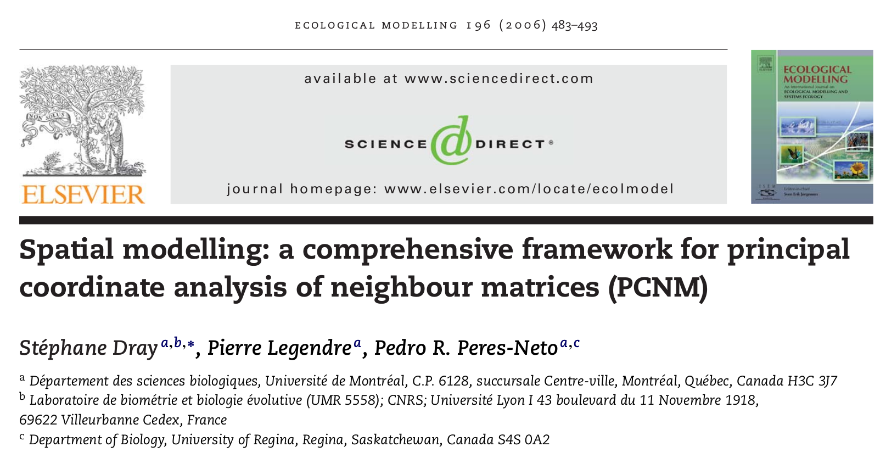
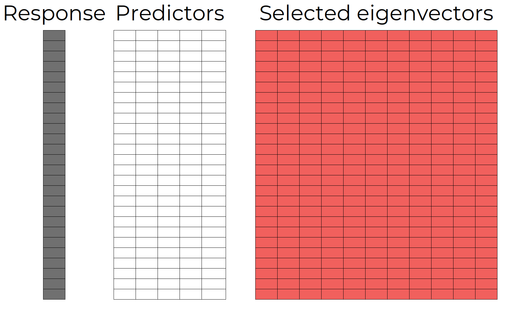

class: center, middle

```{r loadpackages, echo = FALSE, message = FALSE, warning = FALSE}
#required libraries
library(tidyverse)
library(xaringanthemer)
library(patchwork)
library(gstat)
library(raster)
library(geosphere)
library(reshape2)
library(rnaturalearth)
library(kableExtra)
remotes::install_github(
  repo = "blasbenito/spatialRF",
  ref = "development"
  )
library(spatialRF)
source("functions.R")
```


```{r xaringan-themer, include=FALSE, warning=FALSE}
xaringanthemer::style_mono_accent(
  base_color = "#f1605d",
  header_font_google = google_font("Montserrat"),
  text_font_google = google_font("Montserrat"),
  code_font_google = google_font("IBM Plex Mono")
)
xaringanExtra::use_tile_view()
# xaringanExtra::use_animate_all("slide_left")
```

```{r setup, include=FALSE}
options(htmltools.dir.version = FALSE)
```

```{css style settings, echo = FALSE}
@import url(https://fonts.googleapis.com/css?family=IBM+Plex+Mono);

.blockquote {
    padding: 10px  px;
    margin: 0 0 20px;
    font-size: 150%;
    border-left: 5px solid #f1605d;
}

.large { 
  font-size: 250%;
}

.medium { 
  font-size: 200%;
}

.small { 
  font-size: 150%;
}

.tiny {
  font-size: 100%;
}

.content-box { 
    box-sizing: content-box;
    background-color: #e2e2e2;
  /* Total width: 160px + (2 * 20px) + (2 * 8px) = 216px
     Total height: 80px + (2 * 20px) + (2 * 8px) = 136px
     Content box width: 160px
     Content box height: 80px */;
    border-radius: 15px;
    margin: 0 0 25px;
    overflow: hidden;
    padding: 20px;
    width: 100%;
    background-color: #f1605d;
    font-size: 200%;
    color: white;
}

ul {
  list-style: none; /* Remove default bullets */
}

ul li{
 font-size:150%;
}

ul li::before {
  content: "\02192";  /* Add content: \2022 is the CSS Code/unicode for a bullet */
  color: #f1605d; /* Change the color */
  font-weight: bold; /* If you want it to be bold */
  display: inline-block; /* Needed to add space between the bullet and the text */
  width: 1em; /* Also needed for space (tweak if needed) */
  margin-left: -1em; /* Also needed for space (tweak if needed) */
  font-size: 150%;
}

.remark-slide-content.full-slide-fig {
  padding: 0px 0px 0px 0px;
  width: 100%;
}

.remark-code {
  font-size: 26px;
}

.large .remark-code { /*Change made here*/
  font-size: 65% !important;
}

.medium .remark-code { /*Change made here*/
  font-size: 60% !important;
}

.small .remark-code { /*Change made here*/
  font-size: 42% !important;
}
```

# Availability

.left[
.small[

Live slideshow: [https://blasbenito.github.io/spatialRF_talk/talk.html](https://blasbenito.github.io/spatialRF_talk/talk.html)

Github repo: [BlasBenito/spatialRF_talk](https://github.com/BlasBenito/spatialRF_talk)

]
]

```{r echo=FALSE, out.height="40%", fig.retina = 2, out.width= "70%"}

```


---
class: inverse, center, middle


#  WHAT IS <br> SPATIAL AUTOCORRELATION <br> AND <br> WHY DO WE CARE?

---
class: center, middle

## Tobler’s First Law of Geography 

.blockquote[
Everything is usually related to all else, but those which are near to each other are more related when compared to those that are further away.
.right[-- <cite>Waldo Tobler, 1970</cite>]
]

<br>

.content-box[Similarity depends on distance]

<br>
.medium[We call it **spatial autocorrelation** (SAC)]


---
class: center

```{r, fig.height=13, fig.width=17, fig.retina = 2, message = FALSE, error = FALSE, warning = FALSE, echo = FALSE, results = "hide"}

set.seed(1)

#create grid
xy <- expand.grid(1:20, 1:20)
names(xy) <- c("x", "y")

#create distance matrix
xy.distance <- as.matrix(dist(xy))

#HIGH AUTOCORRELATION

#model
model.positive <- gstat(
  formula = z~1, 
  locations = ~x+y, 
  dummy = T, 
  beta = 1, 
  model = vgm(psill = 0.025, range = 200, model = 'Exp'), 
  nmax = 20
  )

#predict
xy.positive <- predict(
  model.positive, 
  newdata = xy, 
  nsim = 1
  )

#plot
xy.positive.matrix <- ggplot(data = xy.positive) + 
  aes(
    x = x,
    y = y,
    fill = sim1
  ) + 
  geom_tile() + 
  coord_fixed(expand = FALSE) + 
  scale_fill_viridis_c(option = "C", direction = -1) + 
  theme_bw(base_size = 25) + 
  labs(x = "", y = "") + 
  theme(
    legend.position = "none", 
    plot.title = element_text(hjust = 0.5)
    ) + 
  ggtitle("1")

#moran
xy.positive.moran <- moran_custom(
  x = xy.positive$sim1,
  distance.matrix = xy.distance,
  distance.threshold = 1
)


#NEUTRAL AUTOCORRELATION

#model
model.neutral <- gstat(
  formula = z~1, 
  locations = ~x+y, 
  dummy = T, 
  beta = 1, 
  model = vgm(psill = 0.025, range = 1, model = 'Exp'), 
  nmax = 20
  )

#predict
xy.neutral <- predict(
  model.neutral, 
  newdata = xy, 
  nsim = 1
  )

#plot
xy.neutral.matrix <- ggplot(data = xy.neutral) + 
  aes(
    x = x,
    y = y,
    fill = sim1
  ) + 
  geom_tile() + 
  coord_fixed(expand = FALSE) + 
  scale_fill_viridis_c(option = "C", direction = -1) + 
  theme_bw(base_size = 25) + 
  labs(x = "", y = "") + 
  theme(
    legend.position = "none", 
    plot.title = element_text(hjust = 0.5)
    ) + 
  ggtitle("2")

#moran
xy.neutral.moran <- moran_custom(
  x = xy.neutral$sim1,
  distance.matrix = xy.distance,
  distance.threshold = 1
)

#NEGATIVE AUTOCORRELATION

#values from uniform distribution
xy.negative <- data.frame(
  x = xy$x,
  y = xy$y,
  sim1 = runif(nrow(xy))
)

#plot
xy.negative.matrix <- ggplot(data = xy.negative) + 
  aes(
    x = x,
    y = y,
    fill = sim1
  ) + 
  geom_tile() + 
  coord_fixed(expand = FALSE) + 
  scale_fill_viridis_c(option = "C", direction = -1) + 
  theme_bw(base_size = 25) + 
  labs(x = "", y = "") + 
  theme(
    legend.position = "none", 
    plot.title = element_text(hjust = 0.5)
    ) + 
  ggtitle("3")

#moran
xy.negative.moran <- moran_custom(
  x = xy.negative$sim1,
  distance.matrix = xy.distance,
  distance.threshold = 1
)

#final plot
patchwork::wrap_plots(
  list(
    xy.positive.matrix,
    xy.neutral.matrix,
    xy.negative.matrix,
    xy.positive.moran,
    xy.neutral.moran,
    xy.negative.moran
  ),
  ncol = 3
) + plot_annotation(
  title = "Quantifying autocorrelation with Moran's I",
  theme = theme(
    plot.margin = unit(c(2,0,2,0),"cm"), 
    text = element_text(size = 35), 
    plot.title = element_text(hjust = 0.5)
    )
  )

```

---
class: center middle

```{r, fig.height=9, fig.width=13, fig.retina = 2, message = FALSE, error = FALSE, warning = FALSE, echo = FALSE, results = "hide"}

#gathering Moran's I values over distances for each group
xy.positive.df <- spatialRF::moran_multithreshold(
  x = xy.positive$sim1,
  distance.matrix = xy.distance,
  distance.thresholds = 1:20,
  verbose = FALSE
)$per.distance

xy.positive.df$group <- 1

xy.neutral.df <- spatialRF::moran_multithreshold(
  x = xy.neutral$sim1,
  distance.matrix = xy.distance,
  distance.thresholds = 1:20,
  verbose = FALSE
)$per.distance

xy.neutral.df$group <- 2

xy.negative.df <- spatialRF::moran_multithreshold(
  x = xy.negative$sim1,
  distance.matrix = xy.distance,
  distance.thresholds = 1:20,
  verbose = FALSE
)$per.distance

xy.negative.df$group <- 3

xy.df <- rbind(
  xy.positive.df,
  xy.neutral.df,
  xy.negative.df
)

#plot
xy.df.plot <- ggplot(data = xy.df) +
  aes(
    x = distance.threshold,
    y = moran.i,
    group = as.factor(group),
    color = as.factor(group)
  ) +
  geom_line(size = 2.5) +
  scale_color_viridis_d(option = "C", end = 0.8) +
  scale_x_continuous(breaks = xy.df$distance.threshold) +
  theme_bw(base_size = 30) +
  labs(
    x = "Distance to neighbors", 
    y = "Moran's I",
    title = "Multiscale (or incremental) Moran's I"
  ) +
  theme(
    plot.title = element_text(hjust = 0.5),
    legend.position = "none"
  ) + 
  geom_segment(
    aes(
      x = 2.5,
      y = 0.036,
      xend = 2.5,
      yend = 0.15
    ),
    color = "black"
  ) + 
  geom_segment(
    aes(
      x = 12,
      y = 0,
      xend = 12,
      yend = 0.15
    ),
    color = "black"
  ) + 
  geom_segment(
    aes(
      x = 10,
      y = 0.45,
      xend = 15,
      yend = 0.45
    ),
    color = "black"
  )

#adding insets
xy.df.plot + inset_element(
  xy.positive.matrix +
    theme(
      plot.margin = margin(t = 0, r = 0, b = -15, l = -15),
      axis.ticks = element_blank(),
      axis.text = element_blank(),
      plot.title = element_blank()),
  left = 0.55, bottom = 0.65, right = 0.90, top = 0.95
  ) + 
  inset_element(
  xy.neutral.matrix +
    theme(
      plot.margin = margin(t = 0, r = 0, b = -15, l = -15),
      axis.ticks = element_blank(),
      axis.text = element_blank(),
      plot.title = element_blank()),
  left = 0.00, bottom = 0.15, right = 0.25, top = 0.45
  ) +
  inset_element(
  xy.negative.matrix +
    theme(
      plot.margin = margin(t = 0, r = 0, b = -15, l = -15),
      axis.ticks = element_blank(),
      axis.text = element_blank(),
      plot.title = element_blank()),
  left = 0.45, bottom = 0.10, right = 0.70, top = 0.40
  )
```
```{r, include = FALSE}
#removing objects we don't need
rm(model.neutral, model.positive, xy.df, xy.df.plot, xy.negative, xy.negative.df, xy.negative.matrix, xy.negative.moran, xy.neutral, xy.neutral.df, xy.neutral.matrix, xy.neutral.moran, xy.positive, xy.positive.df, xy.positive.matrix, xy.positive.moran)
```


---
class: center, middle

.content-box[What does SAC *really* represent?]

## The *footprint* <br> of the process generating <br> the variable of interest!

.medium[(mixed with the observation scale and sampling structure)]

---
class: center

## Cholera map (John Snow<sup>1</sup>, 1854)

```{r echo=FALSE, out.width="60%", out.height="60%"}

```
<br>

.small[
.footnote[
[1] Not *that* John Snow
]
]

---
class: center

## Cholera map (John Snow, 1854)

```{r echo=FALSE, out.width="60%", out.height="60%"}

```

---
class: center

## Colony of Imperial cormorants <br> (*Leucocarbo atriceps*)


```{r echo=FALSE, out.width="90%", out.height="60%"}

```

.small[

Source: [www.dailymail.co.uk](https://www.dailymail.co.uk/news/article-2982830/Amazing-photographs-thousands-nesting-Cormorants-gather-crowded-beach-annual-nesting-season.html)

]

---
class: center

## Colony of Imperial cormorants <br> (*Leucocarbo atriceps*)


```{r echo=FALSE, out.width="90%", out.height="60%"}
knitr::include_graphics("figures/cormorants2.jpeg")
```

.small[

Source: [www.dailymail.co.uk](https://www.dailymail.co.uk/news/article-2982830/Amazing-photographs-thousands-nesting-Cormorants-gather-crowded-beach-annual-nesting-season.html)

]

---
class: inverse middle center

# SPATIAL PREDICTORS

---
class: middle center

## WHAT ARE <br> SPATIAL PREDICTORS?

.medium[
**Variables representing <br> the spatial structure of the data**
<br><br>
Proxies of the process <br> originating spatial autocorrelation
<br><br>
How?: **Eigenvectors of a neighborhood matrix**

]

---
class: middle center

### A GOOD PAPER TO START

```{r echo=FALSE, out.height="60%", fig.retina = 2, out.width= "100%"}

```


---
class: middle center

## MAIN IDEA

.medium[
**Linear combinations of the eigenvectors of a neighborhood matrix represent all the possible spatial configurations of a given set of spatial records**
]

.small[Let's see how that works!]

---
class: middle center

### HYPOTHETIC SPATIAL RECORDS

```{r, echo=FALSE, out.width="60%", out.height="50%", fig.retina = 2}
#creating the pairs of coordinates
xy <- expand.grid(
  x = 1:5,
  y = 1:5
)

ggplot(data = xy) + 
  aes(
    x = x,
    y = y
  ) + 
  geom_point(color = "#f1605d", size = 10) + 
  theme_bw(base_size = 30) + 
  coord_fixed()
```

---
class: middle center

### DISTANCE MATRIX

<br>

```{r, echo=FALSE, out.height="90%", fig.retina = 2}
#creating the distance matrix
xy.distances <- dist(
  xy, 
  diag = TRUE, 
  upper = TRUE
  ) %>% 
  as.matrix()

ggplot(data = reshape2::melt(xy.distances)) + 
  aes(
    x = Var1,
    y = Var2,
    fill = value
  ) + 
  geom_tile() + 
  theme_bw(base_size = 20) + 
  scale_fill_viridis_c(option = "C", direction = -1) + 
  coord_fixed(expand = FALSE) + 
  labs(fill = "Distance", x = "Observation", y = "Observation") +
  theme(plot.margin = unit(c(0,0,3,0),"cm"))
```

---
class: middle center

### MATRIX OF WEIGHTS

.small[
Computed as 1/distance matrix
]

```{r, echo=FALSE, out.height="90%", fig.retina = 2}
#thresholdding and weights
xy.distances[xy.distances <= 1] <- 1
diag(xy.distances) <- NA
xy.weights <- 1/xy.distances

ggplot(data = reshape2::melt(xy.weights)) + 
  aes(
    x = Var1,
    y = Var2,
    fill = value
  ) + 
  geom_tile() + 
  theme_bw(base_size = 20) + 
  scale_fill_viridis_c(option = "C", direction = -1) + 
  coord_fixed(expand = FALSE) + 
  labs(fill = "Weight", x = "Observation", y = "Observation") +
  theme(plot.margin = unit(c(0,0,3,0),"cm"))
```

---
class: middle center

### NORMALIZED AND DOUBLE-CENTERED

.small[
column and row means are 0
]

```{r, echo=FALSE, out.height="100%", fig.retina = 2}
#normalizing weights
xy.weights.rowsums <- rowSums(
  xy.weights,
  na.rm = TRUE
  )
xy.weights <- xy.weights/xy.weights.rowsums

#removing Inf
xy.weights[xy.weights == Inf] <- 0

#adding zero to diagonals
diag(xy.weights) <- 0

#double centering weights matrix

#compute row means
xy.weights.row.means <- xy.weights*0 + rowMeans(xy.weights)

#compute col means
xy.weights.col.means <- t(xy.weights*0 + colMeans(xy.weights))

#double centering
xy.weights.double.centered <- (xy.weights - xy.weights.row.means - xy.weights.col.means + mean(xy.weights[]))

#adding zero to diagonals
diag(xy.weights.double.centered) <- 0

ggplot(data = reshape2::melt(xy.weights.double.centered)) + 
  aes(
    x = Var1,
    y = Var2,
    fill = value
  ) + 
  geom_tile() + 
  theme_bw(base_size = 20) + 
  scale_fill_viridis_c(option = "C", direction = -1) + 
  coord_fixed(expand = FALSE) + 
  labs(fill = "Double \n centered \n weights", x = "Observation", y = "Observation") +
  theme(plot.margin = unit(c(0,0,3,0),"cm"))
```

---
class: middle center

### EIGENVECTORS IN SPACE

```{r, echo=FALSE, fig.retina = 2, fig.width=10, fig.height=7.5, out.width="120%", out.height="60%"}
#eigenvalues and eigenvectors
xy.eigen <- eigen(
  xy.weights.double.centered,
  symmetric = TRUE
)

ggplot(data = cbind(
  xy, 
  xy.eigen$vectors
  ) %>% 
    tidyr::pivot_longer(
      cols = 3:27, 
      names_to = "eigenvector",
      values_to = "value"
      ) %>% 
    dplyr::mutate(eigenvector = factor(eigenvector, levels = as.character(1:25)))
  ) + 
  aes(
    x = x,
    y = y, 
    fill = value,
    group = eigenvector
  ) +
  facet_wrap("eigenvector", ncol = 7) + 
  geom_tile() + 
  coord_cartesian(expand = FALSE) + 
  scale_fill_gradient2(
    midpoint = 0, 
    low = "#787878", 
    mid = "white", 
    high = "#f1605d"
    ) + 
  labs(x = "", y = "", fill = "Value") + 
  theme(strip.background = element_rect(
    colour = "black", 
    fill = "white"
    )
    ) + 
  theme_bw(base_size = 15) +
  theme(plot.margin = unit(c(0,0,3,0),"cm"))
```

---
class: middle center

### EIGENVECTORS WITH MORAN'S I > 0

```{r, echo=FALSE, fig.retina = 2, fig.width=10, fig.height=7, out.width="120%", out.height="60%"}
#normalize eigenvalues
xy.eigenvalues <- xy.eigen$values/max(abs(xy.eigen$values))

#get positive mem (all of them have positive values)
xy.positive.eigenvectors <- as.data.frame(xy.eigen$vectors[, which(xy.eigenvalues > 0)])

#rank by Moran's I
xy.selected.eigenvectors <- spatialRF::rank_spatial_predictors(
  distance.matrix = xy.distances,
  distance.thresholds = 0,
  spatial.predictors.df = xy.positive.eigenvectors,
  ranking.method = "moran"
  )

#preparing plotting dataframe
plot.df <- cbind(
  xy, 
  xy.selected.eigenvectors$spatial.predictors.df
  ) 
colnames(plot.df) <- c(
  "x", "y", 
  paste0(
    "Moran's I = ", 
    round(xy.selected.eigenvectors$criteria$ranking.criteria, 3)
    )
  )

plot.df <- plot.df %>% 
  tidyr::pivot_longer(
      cols = 3:7, 
      names_to = "eigenvector",
      values_to = "value"
      ) %>% 
    dplyr::mutate(eigenvector = factor(eigenvector, levels = paste0(
    "Moran's I = ", 
    round(xy.selected.eigenvectors$criteria$ranking.criteria, 3)
    )))

ggplot(data = plot.df
  ) + 
  aes(
    x = x,
    y = y, 
    fill = value,
    group = eigenvector
  ) +
  facet_wrap("eigenvector", ncol = 3) + 
  geom_tile() + 
  coord_cartesian(expand = FALSE) + 
  scale_fill_gradient2(
    midpoint = 0, 
    low = "#787878", 
    mid = "white", 
    high = "#f1605d"
    ) + 
  labs(x = "", y = "", fill = "Value") + 
  theme(strip.background = element_rect(colour = "black", fill = "white")) + 
  theme_bw(base_size = 15) +
  theme(plot.margin = unit(c(0,0,3,0),"cm"))
```

---
class: middle center

### MODEL TRAINING

```{r echo=FALSE, out.width="90%", out.height="60%", fig.retina = 2}

```


---
class: inverse middle center

# Example with the R package *spatialRF*

```{r, echo = FALSE}
rm(list=ls())
```


---
class: middle center

## The R package *spatialRF*

.left[

- Github repo: [https://github.com/BlasBenito/spatialRF](https://github.com/BlasBenito/spatialRF)
- Website: [https://blasbenito.github.io/spatialRF/](https://blasbenito.github.io/spatialRF/)
- Not in CRAN yet.

.small[Install:]

.medium[
```{r, eval = FALSE}
remotes::install_github(
  repo = "blasbenito/spatialRF",
  ref = "development"
  )
library(spatialRF)
```


]

]

---
class: middle left

## EXAMPLE DATA

.pull-left[
.tiny[
- **Response variable**: plant richness of the American ecoregions
- **14 predictors** (climate, fragmentation, human impact, etc)
- **Distance matrix** among the ecoregion polygons (centroids shown in the figure)
]
]

.pull-right[

```{r, echo = FALSE, fig.retina=2, out.width="100%", out.height = "100%"}
world <- rnaturalearth::ne_countries(
  scale = "medium", 
  returnclass = "sf"
  )

ggplot2::ggplot() +
  ggplot2::geom_sf(
    data = world, 
    fill = "white"
    ) +
  ggplot2::geom_point(
    data = plant_richness_df,
    ggplot2::aes(
      x = x,
      y = y,
      color = richness_species_vascular
    ),
    size = 2.5
  ) +
  ggplot2::scale_color_viridis_c(
    direction = -1, 
    option = "C"
    ) +
  ggplot2::theme_bw(base_size = 20) +
  ggplot2::labs(color = "Plant \n richness") +
  ggplot2::scale_x_continuous(limits = c(-170, -30)) +
  ggplot2::scale_y_continuous(limits = c(-58, 80))  +
  ggplot2::xlab("Longitude") + 
  ggplot2::ylab("Latitude") +
  theme(
    legend.position = "bottom", 
    plot.margin = unit(c(0,0,0,0),"cm"),
    legend.key.width = unit(2, "cm")
    )
```

]

---
class: middle left

### MODELLING SETUP

.left[
.small[

```{r}
#loading training data and distance matrix
data(plant_richness_df)
data(distance_matrix)

#names of the response and predictors
response.name <- "richness_species_vascular"
predictor.names <- c(
  "human_population",               #human
  "human_population_density",
  "human_footprint_average",
  "climate_hypervolume",            #climate
  "climate_bio1_average", 
  "climate_bio15_minimum",
  "climate_aridity_index_average",
  "climate_velocity_lgm_average",
  "neighbors_area",                 #neighbours
  "neighbors_count", 
  "neighbors_percent_shared_edge", 
  "bias_area_km2",                  #size and shape
  "fragmentation_cohesion",
  "fragmentation_division"
  )

#distance thresholds in km
distance.thresholds <- c(50, 500, 5000)
```
]
]

```{r, include = FALSE, echo = FALSE}
#random seed for reproducibility
random.seed <- 1
```


---
class: middle left

### FITTING THE MODELS

.medium[
```{r, eval = TRUE, results = "hide", message = FALSE, warning = FALSE, error = FALSE, fig.show='hide'}
#non-spatial model, predictors only
model.non.spatial <- spatialRF::rf(
  data = plant_richness_df,
  dependent.variable.name = response.name,
  predictor.variable.names = predictor.names,
  distance.matrix = distance_matrix,
  distance.thresholds = distance.thresholds
)

#spatial model, predictors and spatial predictors
model.spatial <- spatialRF::rf_spatial(
  model = model.non.spatial,
  method = "mem.moran.sequential"
)
```
]

---
class: middle left

## COMPARING THE MODELS WITH SPATIAL CROSS-VALIDATION

.pull-left[
.small[
<br>
```{r, eval = TRUE, results = "hide", fig.show='hide'}
model.comparison <- spatialRF::rf_compare(
  models = list(
    model.non.spatial = model.non.spatial,
    model.spatial = model.spatial
  ),
  xy = plant_richness_df[, c("x", "y")],
  repetitions = 100,
  metrics = "rmse"
)
```
]
]

.pull-right[
```{r, echo = FALSE, fig.retina=2, fig.width=10, fig.height=10, out.width="100%"}
plot.df <- plant_richness_df[, c("x", "y")]
plot.df$group.2 <- plot.df$group.1 <- "Training"
plot.df[model.comparison$spatial.folds[[1]]$testing, "group.1"] <- "Testing"

ggplot2::ggplot() +
  ggplot2::geom_sf(
    data = world, 
    fill = "white"
  ) +
  ggplot2::geom_point(
    data = plot.df,
    ggplot2::aes(
      x = x,
      y = y,
      color = group.1
    ),
    size = 2
  ) +
  scale_color_manual(values = c("#696969", "#f1605d")) +
  ggplot2::theme_bw(base_size = 20) +
  ggplot2::labs(color = "Group") +
  ggplot2::scale_x_continuous(limits = c(-170, -30)) +
  ggplot2::scale_y_continuous(limits = c(-58, 80))  +
  ggplot2::ggtitle("Spatial fold 1") + 
  ggplot2::theme(
    plot.title = ggplot2::element_text(hjust = 0.5),
    legend.position = "bottom", 
    plot.margin = unit(c(0,0,3,0),"cm")
  ) + 
  ggplot2::xlab("Longitude") + 
  ggplot2::ylab("Latitude")
```
]

---
class: middle center

## MODEL COMPARISON
<br>

```{r, echo = FALSE}
comparison.df <- data.frame(
  model = c(
    "Non spatial",
    "Spatial"
  ),
  spatial.predictors = c(
    0,
    length(model.spatial$spatial$names)
  ),
  moran.i.residuals = c(
    model.non.spatial$residuals$autocorrelation$per.distance$moran.i[1],
    model.spatial$residuals$autocorrelation$per.distance$moran.i[1]
  ),
  extrinsic.rmse = c(
    median(
      model.comparison$comparison.df %>% dplyr::filter(model == "model.non.spatial") %>% dplyr::select(value) %>% 
        pull()
      ),
    median(
      model.comparison$comparison.df %>% dplyr::filter(model == "model.spatial") %>% dplyr::select(value) %>% 
        pull()
      )
  )
) %>% 
  dplyr::mutate(
    moran.i.residuals = round(moran.i.residuals, 2),
    extrinsic.rmse = round(extrinsic.rmse, 0)
  )

kableExtra::kbl(
  comparison.df, 
  format = 'html',
  col.names = c("Model", "spatial predictors", "Moran's I of residuals", "RMSE spatial cv")
  )
```


---
class: middle center

## VARIABLE IMPORTANCE

```{r, fig.width=10, fig.height=7, out.width="120%", fig.retina = 2, out.height="60%", message = FALSE, error = FALSE, warning = FALSE, echo = FALSE, results = "hide"}

importance.df <- rbind(
  model.non.spatial$importance$per.variable %>% 
  dplyr::mutate(model = "Non spatial"),
   model.spatial$importance$spatial.predictors %>% 
  dplyr::mutate(model = "Spatial")
) %>% 
  dplyr::arrange(desc(importance))

ggplot(data = importance.df) + 
  aes(
    x = importance,
    y = reorder(
          variable,
          importance,
          FUN = max
        ),
        color = model
  ) +
   ggplot2::geom_point(
        size = 4,
        ) + 
  theme_bw(base_size = 15) + 
  labs(
    y = "", 
    x = "Increase in RMSE when permuted", 
    color = "Model"
    ) + 
  scale_color_manual(values = c("#696969", "#f1605d")) +
  theme(
    plot.margin = unit(c(0,0,3,0),"cm"), 
    legend.position = "bottom"
    )
```

---
class: middle center

## IMPORTANCE OF SPATIAL PREDICTORS

```{r, fig.width=10, fig.height=7, out.width="120%", fig.retina = 2, out.height="60%", message = FALSE, error = FALSE, warning = FALSE, echo = FALSE, results = "hide"}

importance.df <- model.spatial$importance$per.variable %>% 
  dplyr::filter(grepl("spatial_predictor", variable))

ggplot(data = importance.df) + 
  aes(
    x = importance,
    y = reorder(
          variable,
          importance,
          FUN = max
        ),
        color = importance
  ) +
   ggplot2::geom_point(
        size = 4,
        color = "#f1605d"
        ) + 
  theme_bw(base_size = 15) + 
  labs(
    y = "", 
    x = "Increase in RMSE when permuted", 
    color = "Model"
    ) + 
  theme(
    plot.margin = unit(c(0,0,3,0),"cm"), 
    legend.position = "none"
    )
```


---
class: middle center

## RESPONSE CURVES

```{r, fig.width=10, fig.height=7, out.width="120%", fig.retina = 2, out.height="60%", message = FALSE, error = FALSE, warning = FALSE, echo = FALSE, results = "hide"}
variables <- c("human_population", "climate_bio1_average", "climate_hypervolume", "bias_area_km2")
plot.df <- rbind(
  spatialRF::get_response_curves(
    model = model.non.spatial,
    variables =variables,
    quantiles = 0.5
  ) %>% 
    dplyr::mutate(model = "Non spatial"),
  spatialRF::get_response_curves(
    model = model.spatial,
    variables = variables,
    quantiles = 0.5
  ) %>% 
    dplyr::mutate(model = "Spatial")
)

ggplot(data = plot.df) + 
  aes(
    x = predictor,
    y = response,
    group = model,
    color = model
  ) + 
  geom_path(size = 1) + 
  facet_wrap("predictor.name", scales = "free", ncol = 2) + 
  theme_bw(base_size = 20) +
    labs(
    y = "Richness of vascular plants", 
    x = "", 
    color = "Model"
    ) + 
  scale_color_manual(values = c("#696969", "#f1605d")) +
  theme(
    plot.margin = unit(c(0,0,1,0),"cm"), 
    legend.position = "bottom"
    )
```

---
class: middle left

## A FEW IDEAS


- **Spatial predictors** reduce SAC in model residuals
- **Spatial predictors** hinder model transferability
- **Eigenvectors**: Outcome similar to base model, plus information about the importance of spatial processes
- Computational demands limit sample size (1000 to 5000, depending on the available RAM)

---
class: middle center

## FINAL MESSAGE

.medium[
Incorporating spatial predictors into machine learning models might help unveil underlying spatial processes not represented by the covariates.
]

---
class: middle
background-image: url("figures/end.png")
background-size: contain

